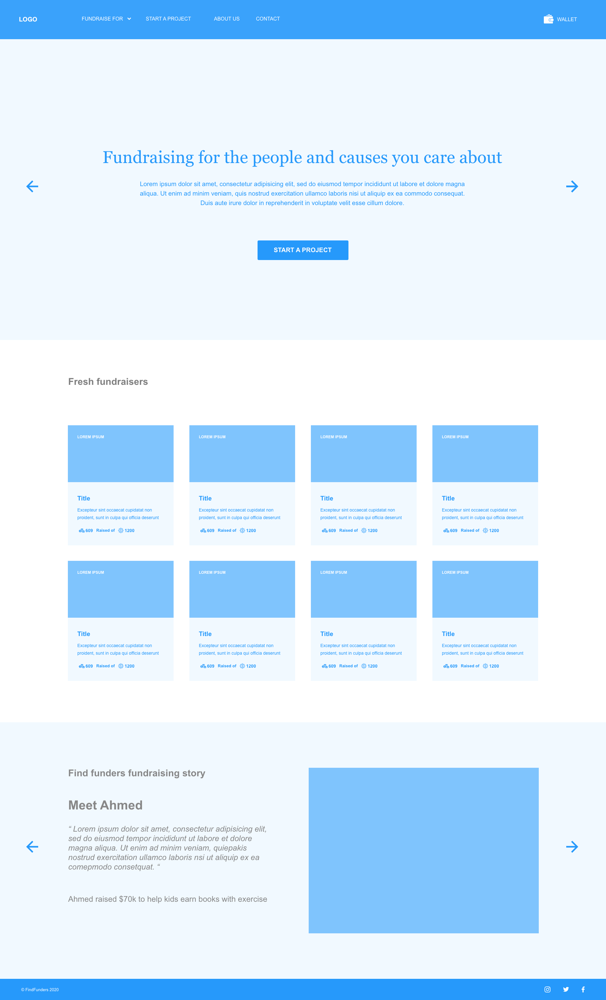
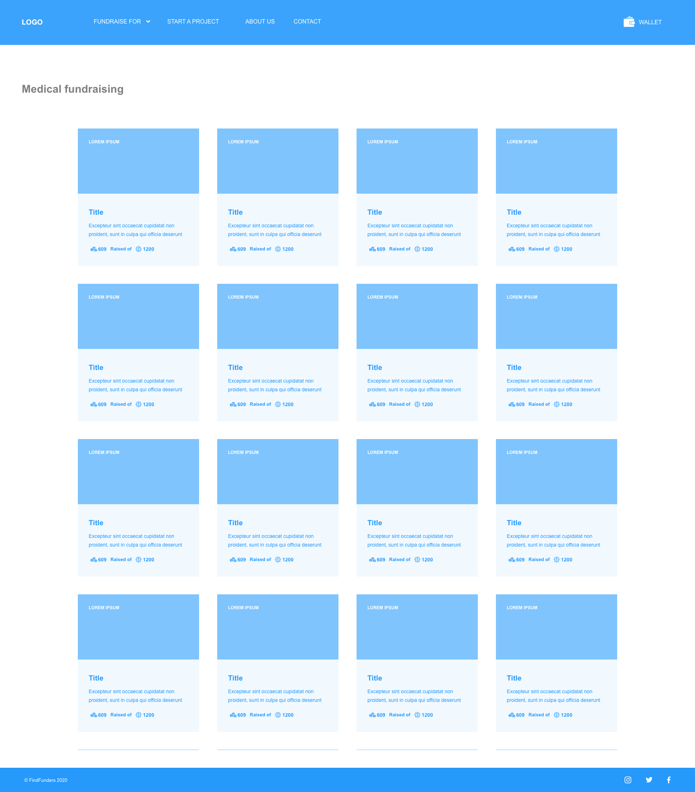
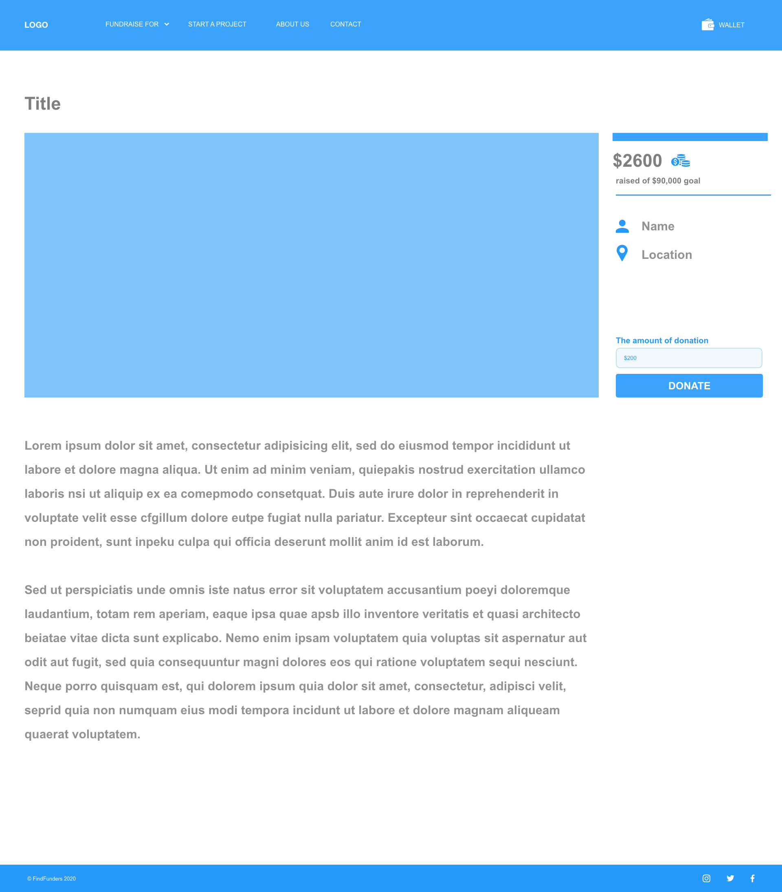
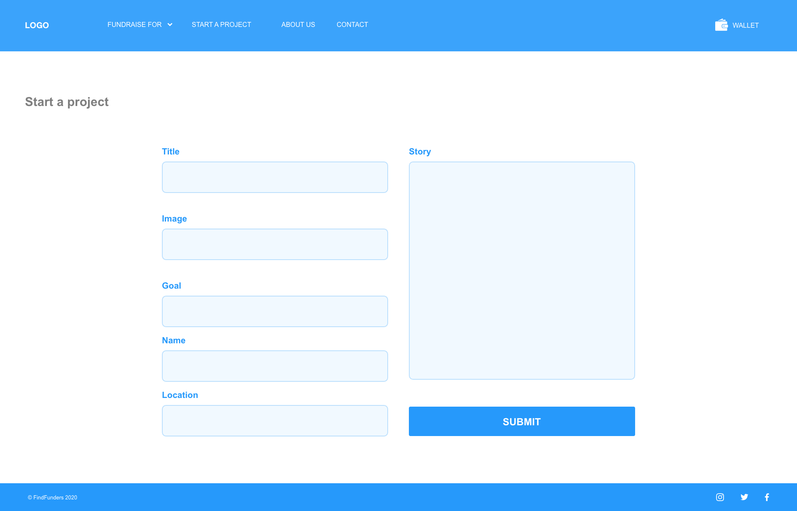
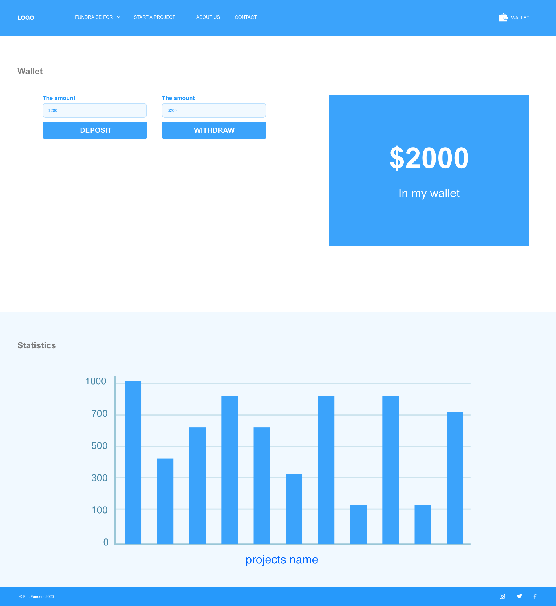
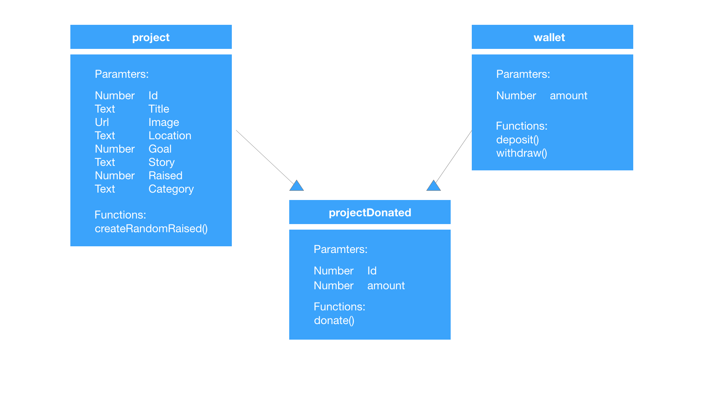

# FindFunder

## Table of Contents

- [About the Project](#about-the-project)
- [Wireframes](#Wireframes)
- [User Stories](#User-Stories)
- [Domain Modeling](#Domain-Modeling)
- [Contributing](#contributing)
- [License](#license)
- [Contact](#contact)

# About the Project

It is a place to go where you are in need of financial support for profit and non profit reasons or to
help your fellow human beings by donating to a cause or to find the new million dollar idea to invest in
it will contain a form to insert your fundraiser project and view them , it shows how much was invested
and how much you paid.

**MVP** : 
1. it take in projects 
2. it display the projects
3. keep track of donations
4. takes in donations and track of donater wallet

# Wireframes

- Home Page

- Projects based on categories page

- Project page

- Start a new project page

- Wallet page

# User Stories

1. As a user, I would like add a new fundraising project so that I can actually create it.

- **Feature Tasks**:
 - Create an html form so that the user can insert his project information
 - Create a constructor function that creates an object associated with each project.
  - Id (auto increment)
  - Title 
  - Image path (URL) 
  - Goal (amount of money that the user wants)
  - Story 
  - Raised (the amount of money that the user gets)
  - Category of the project (one of three categories [education, medical, non-profit]).
  - Name of the user
  - Location of the user
 - Create a function that will randomly generate random number for that amount of money that raised for each project (for the sake of the demo)
 - Store every project object in array.
 - Store the array of project in the local storage.
 - Filter the projects to three arrays based on category.
 - Store the three arrays in the local storage.

- **Acceptance Tests**:
 - Ensure that you update the projects array with the new project with new id.
 - Ensure you update the filtered arrays every time you create new project.

2. As a user, I would like to keep a track of the donations so I can know how much I got in my project.

- **Feature Tasks**:
 - Add an event listener to html element that holds the project information in the page that displays projects as cards view 
 - Create new html document that have the tags needed to display user project information.
 - Get the projects array from the local storage.
 - Get the html elements.
 - Create a function to filter the array of projects by id.
 - Assign each project information to it is suitable html tag.
 - Redirect the user to the page to display the project information.

- **Acceptance Tests**:
 - Ensure that you entered the page of the selected project

3. As a user, I would like to navigate through projects to determine which project to donat.

- **Feature Tasks**:
 - *Hompe page:*
  - Get all the projects from local storage.
  - Create function that will display projects randomly.
 - *Category-based page:*
  - Get the category array from local storage.
  - Create a function to display this array.

- **Acceptance Tests**:
 - Ensure in the category-based page that your displaying the projects correctly based on the category of the button that will redirect to this page.

4. As user, I would like to select any project that I want to donate.

- **Feature Tasks**:
 - Add event listener to the project in home page and category-based page.
 - Create function to get this project from array of projects in local storage.
 - Create function to display the project information in new document.
 - Create an event listener on a donation button to make a donation with specific amount and deduct the amount form the wallet amount.
 - save the id of the project and the amount of donation in object and push it to array.
 - Store the array in the local storage.

- **Acceptance Tests**:
 - 	Ensure the user have entered the correct project that he selected.
 - Ensure that you deduct the same amount the entered in the text input.
 - Ensure that the user have enough money in his wallet.

 5.	As user, I would like to have a wallet to deposit amount of money for the sake of making a donation in several projects.

 - **Feature Tasks**:
  - Create a variable or object for a wallet.
  - Create function to deposit specific amount of money to the wallet.
  - Create function to withdraw specific amount of money from the wallet.

- **Acceptance Tests**:
  - Ensure that when you deposit or withdraw to update the local storage.

6. As user, I would like to have a chart to show me a statistics about my donations.
- **Feature Tasks**:
 - Include a chartjs library in my wallet page.
 - Get the array of donations from local storage.
 - Display the chart.

- **Acceptance Tests**:
-	Ensure that you clear that chart before every time you update it.

# Domain Modeling

# Contribution :

- [Waleed Farraj](https://github.com/waleedfarraj)
- [Mohammad Samara](https://github.com/mohammad-samara)
- [Duha Saleh](https://github.com/Duha-Saleh◊)
- [Sondos Matahen](https://github.com/SondosMatahen)
- [Abdallah Safi](https://github.com/AbdallahSafi)

# License

Distributed under the MIT License. See [LICENSE](https://www.mit.edu/~amini/LICENSE.md) for more information.
